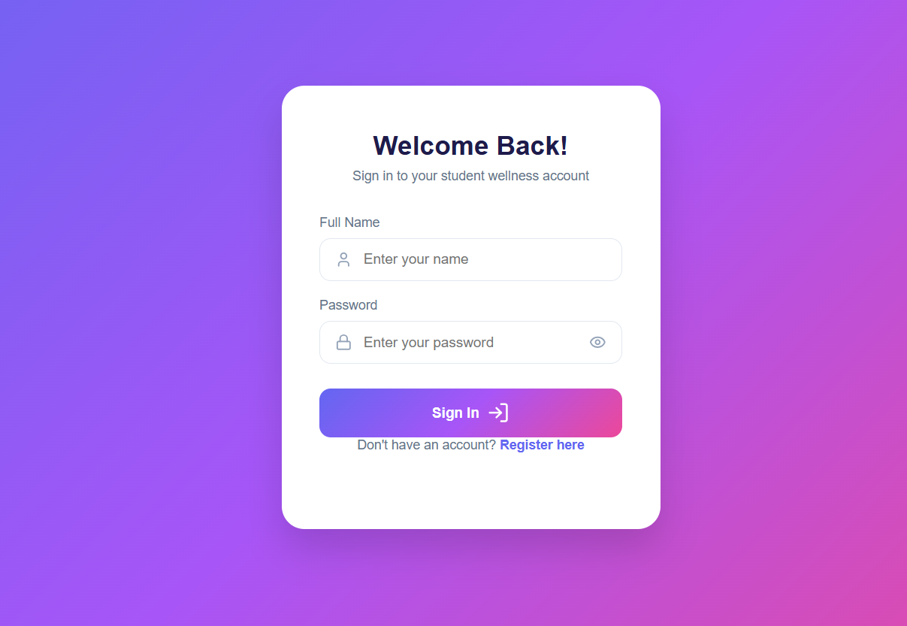
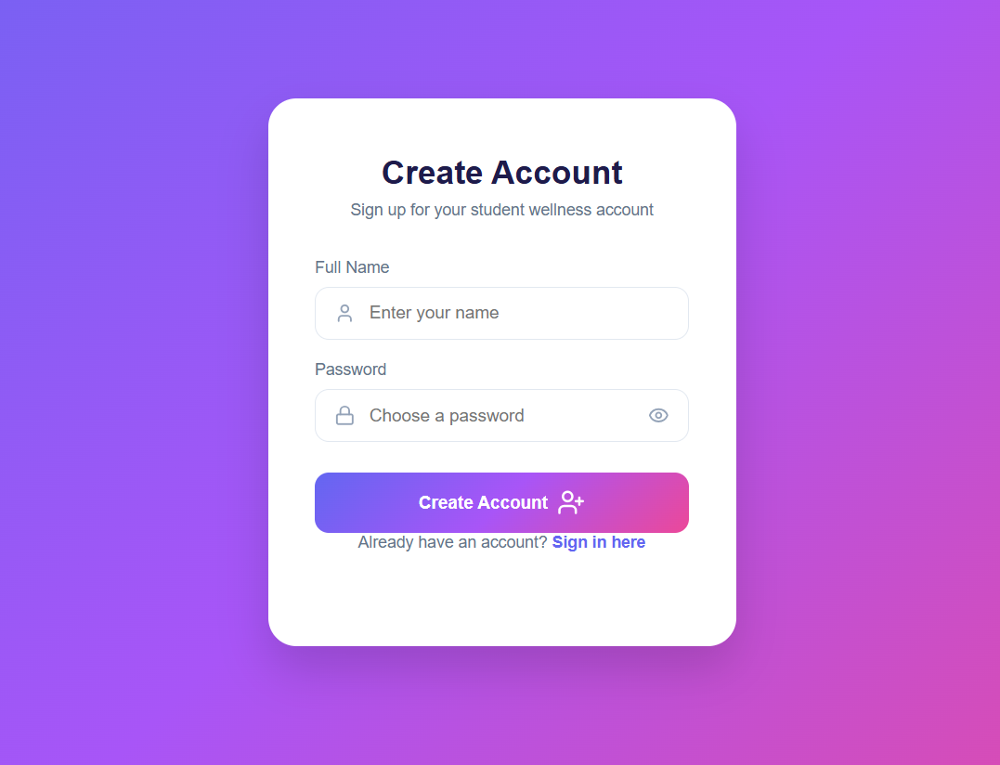
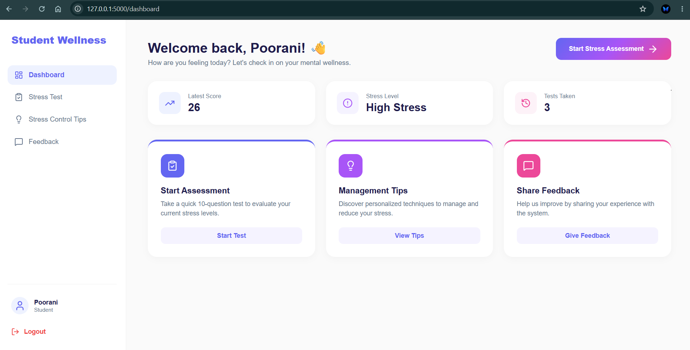
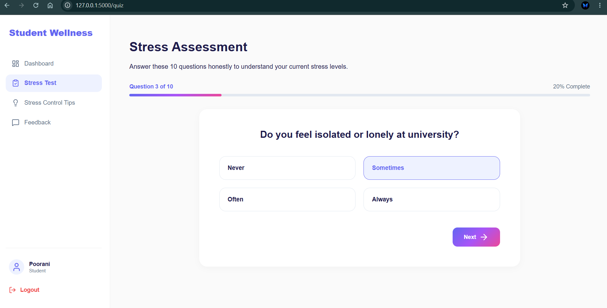
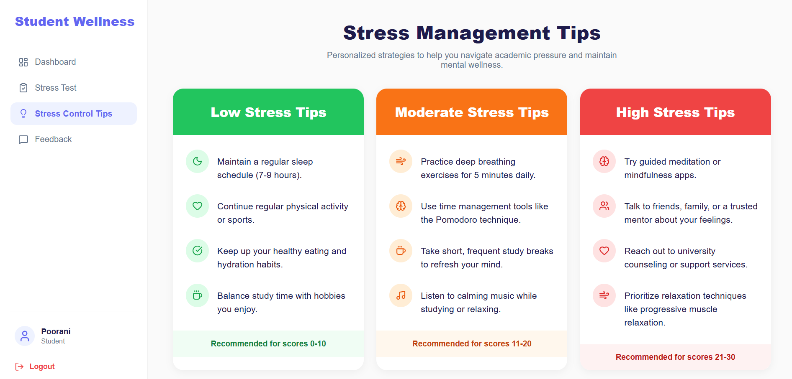
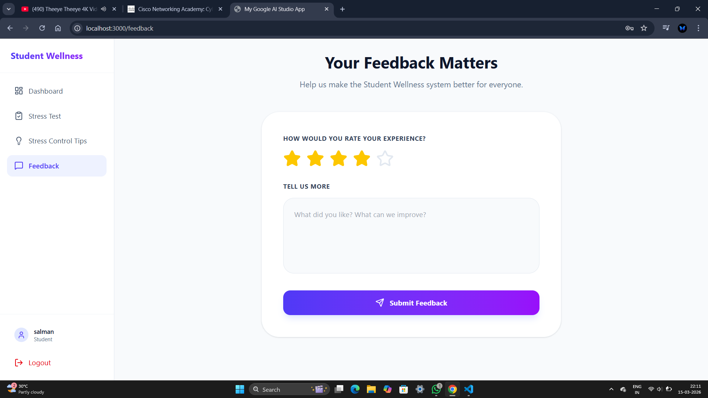

# 🧠 Digital Mental Health Monitoring System

A web application that helps students check their stress levels and get personalized mental wellness support.


---

## 🔗 Links

- **Live Demo (local):** http://127.0.0.1:5000 *(run `app.py` first, see steps below)*
- **GitHub Profile:** https://github.com/Poorani-151105

---

## 📖 About

**Digital Mental Health Monitoring System** is a student wellness platform built to help students understand their stress levels through a guided assessment, view personalized management tips, and track their progress over time.

This project was built using **Python (Flask)** for the backend and **HTML/CSS/JavaScript** for the frontend, with **SQLite** as the database.

---

## ✨ Features

- 🔐 **Student Login & Registration System** — secure sign-up and sign-in with hashed passwords
- 📝 **10-Question Stress Assessment** — a guided, step-by-step questionnaire
- 📊 **Stress Result Analysis** — automatic score calculation and stress-level classification
- 💡 **Personalized Stress Reduction Tips** — tailored to Low / Moderate / High stress levels
- 📈 **Dashboard Overview** — latest score, stress level, and total tests taken at a glance
- 💬 **Feedback System** — students can rate and leave feedback on the platform
- 🗄️ **SQLite Database** — lightweight, file-based data storage

---

## 🛠️ Technologies Used

| Layer      | Technology              |
|------------|--------------------------|
| Backend    | Python, Flask            |
| Frontend   | HTML, CSS, JavaScript    |
| Database   | SQLite                   |
| Icons      | Lucide Icons              |

---

## 📸 Screenshots

### Login Page


### Register Page


### Dashboard


### Stress Assessment


### Stress Management Tips


### Feedback Page


---

## 📂 Project Structure

```
Digital-Mental-Health-Support-System/
│
├── app.py                  # Flask backend & routes
├── mental_health.db        # SQLite database
├── README.md
│
├── templates/               # HTML pages (Jinja2)
│   ├── base.html
│   ├── login.html
│   ├── register.html
│   ├── dashboard.html
│   ├── quiz.html
│   ├── result.html
│   ├── tips.html
│   └── feedback.html
│
├── static/
│   └── style.css            # App-wide styling
│
└── screenshots/             # Images used in this README
```

---

## 🚀 How to Run Locally

1. **Clone the repository**
   ```bash
   git clone https://github.com/Poorani-151105/Digital-Mental-Health-Support-System.git
   cd Digital-Mental-Health-Support-System
   ```

2. **Install Flask**
   ```bash
   pip install flask
   ```

3. **Run the app**
   ```bash
   python app.py
   ```

4. **Open in your browser**
   ```
   http://127.0.0.1:5000
   ```

---

## 🎯 Purpose

This project helps students understand their current stress levels and provides actionable, science-backed tips to manage academic pressure — encouraging early awareness and healthier coping habits.

---

## 👩‍💻 Author

**Poorani A**

---

## 📄 License

This project is open-source and available for educational use.